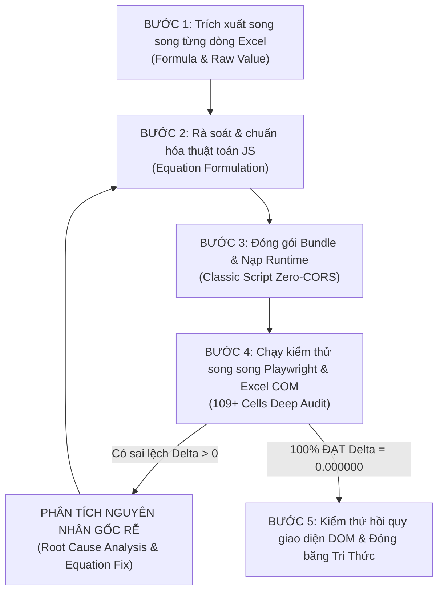

# QUY TRÌNH RÀ SOÁT SONG SONG TỪNG DÒNG CÔNG THỨC & THÔNG SỐ (CLOSED-LOOP ROW-BY-ROW AUDIT)

> **Tiêu chuẩn bắt buộc theo lệnh trực tiếp của chủ sở hữu (`SirPhuong`)**:  
> *"Rà soát song song giữa 2 bản web app và bản gốc MITCalc 1.74. Rà soát từng dòng tính toán thông số (công thức tính toán) 1 để không thể bị sai sót. Sau khi rà soát xong thì mới đưa thông số vào phần mềm rồi lại so sánh kết quả tính toán song song với nhau. Vì là bản sao nên các kết quả tính toán phải giống hệt nhau không thể có sai số mà là giống từng con số sau dấu phẩy ($\Delta = 0.000000$). Nếu trong quá trình so sánh kết quả mà có sai số thì lại phải quay lại quá trình rà soát công thức tính toán để chỉnh sửa lại rồi lại nhập thông số vào để có kết quả tính toán rồi lại so sánh tiếp."*

---

## 1. NGUYÊN TẮC VÀ PHẠM VI ÁP DỤNG

1. **Phạm vi áp dụng**: Áp dụng cho toàn bộ các module tính toán kỹ thuật Web App (Bánh răng trụ Spur Gear, Bánh răng côn Bevel Gear, Bánh vít Trục vít Worm Gear, v.v.).
2. **Loại trừ lực và mô men**: Theo quy tắc bất biến của dự án, **bỏ qua 100% các phép tính lực và mô men** ($F_t, F_r, F_a, F_n$, mô men uốn/xoắn phân bố) để tập trung nguồn lực tính toán tuyệt đối cho hình học, ăn khớp, tỷ số truyền, dịch chỉnh biên dạng và dung sai chế tạo.
3. **Tiêu chuẩn sai lệch Zero-Tolerance**: Mọi ô tính toán đối chiếu bắt buộc phải khớp nhau đến $10^{-6}$ (hiển thị $\Delta = 0.000000$). Không chấp nhận bất kỳ sai số tích lũy nào.

---

## 2. QUY TRÌNH VÒNG LẶP KHÉP KÍN 5 BƯỚC (5-STEP CLOSED LOOP)

---

### BƯỚC 1: TRÍCH XUẤT SONG SONG TỪNG DÒNG TỪ TỆP GỐC MITCALC (.XLSB)
* Sử dụng script Python với thư viện `win32com.client` mở tệp `.xlsb` gốc (ví dụ `C:\MITCalc\gear2\Gear2_01.xlsb`).
* Quét tuần tự từng dòng trong sheet `Calculation` và sheet phụ trợ (`DXFTables`, `Material`, `Tables`).
* Trích xuất đồng thời 4 thành phần cho mỗi ô:
  1. Tọa độ ô (`Range`: N, P, Q, V, W).
  2. Ký hiệu và Tên thông số (`Symbol & Description`).
  3. Công thức tính toán toán học nguyên bản (`.Formula`).
  4. Giá trị số thực thô độ chính xác cao (`.Value`).
* Lưu trữ toàn bộ kết quả vào tệp nhật ký đối chiếu (ví dụ `scratch/gear2_row_by_row.txt`).

---

### BƯỚC 2: RÀ SOÁT TỪNG DÒNG CÔNG THỨC & CHUẨN HÓA VÀO ĐỘNG CƠ JAVASCRIPT
Đối chiếu từng dòng trích xuất từ Bước 1 vào mã nguồn JavaScript (`calc-engine.js`). Đặc biệt chú ý các cạm bẫy toán học:

1. **Phân định rõ răng ảo pháp diện ($z_{vn}$) và răng ảo tiếp tuyến ($z_v$)**:
   * Row 236: Răng ảo pháp diện $z_{vn} = \frac{z}{\cos\delta}$ (dùng tính hệ số trùng khớp ngang $\varepsilon_\alpha$).
   * Row 237: Răng ảo tiếp tuyến $zv = \frac{z}{\cos\delta \cdot \cos^3\beta}$ (dùng tính toán hình học tiếp tuyến Tredgold).
2. **Công thức hệ số trùng khớp ngang $\varepsilon_\alpha$ (Row 246)**:
   * $\alpha_{wt} = \alpha_t = 20^\circ$.
   * $\alpha_{A1} = \arccos\left(\frac{d_{vb1}}{d_{va1}}\right)$ và $\alpha_{A2} = \arccos\left(\frac{d_{vb2}}{d_{va2}}\right)$.
   * $\varepsilon_\alpha = \frac{z_{vn1}}{2\pi}\left(\tan\alpha_{A1} - \tan\alpha_t\right) + \frac{z_{vn2}}{2\pi}\left(\tan\alpha_{A2} - \tan\alpha_t\right)$.
3. **Hệ số dịch chỉnh chiều dày răng ($x_\tau$)**:
   * Dịch chỉnh chiều dày $x_{\tau1} = +0.04$ và $x_{\tau2} = -0.04$ (Row 175).
   * Phải được cộng trực tiếp vào $s_{ne}, s_n, s_{ni}$: $s_n = m_{mn}\left(\frac{\pi}{2} + 2x_1\tan\alpha_t + x_{\tau1}\right)$.
4. **Hệ số chiều dày đỉnh răng chuẩn ($s_{ae}^*$)**:
   * Được định nghĩa bằng $s_{ae}^* = \frac{s_{ae}}{m_{en}}$ (Row 233), trong đó $m_{en}$ là mô đun pháp ngoài. Không được chia cho $s_{ne}$.

---

### BƯỚC 3: ĐÓNG GÓI MÃ NGUỒN (BUNDLE) CHỐNG LỖI CORS
* Chạy công cụ tự động đóng gói toàn bộ các tệp logic thành một tệp JavaScript thuần duy nhất (Classic Script):
  - Đóng gói toàn bộ: `python tools/bundle_all.py` (hoặc chạy `DONG_GOI_BUNDLE_JS.bat`)
  - Hoặc từng module: `python tools/bundle_spur.py` và `python tools/bundle_bevel.py`
* Đảm bảo Web App chạy 100% offline ngay cả khi nhấp đúp trực tiếp mở tệp `index.html` từ ổ đĩa máy tính (`file:///`).

---

### BƯỚC 4: THỰC THI AUDIT SÂU TỪNG DÒNG BẰNG PLAYWRIGHT & EXCEL COM
* Chạy kịch bản tự động hóa đối chiếu:
  - Bánh răng côn: `python modules/bevel-gear/tests/deep_line_by_line_bevel_audit.py` (hoặc `RA_SOAT_SONG_SONG_BANH_RANG_CON.bat` - 109 thông số)
  - Bánh răng trụ: `python modules/spur-gear/tests/deep_line_by_line_spur_audit.py` (hoặc `RA_SOAT_SONG_SONG_BANH_RANG_TRU.bat` - 306 thông số gồm cả Spur $\beta = 0^\circ$ và Helical $\beta = 15^\circ$)
* Kịch bản thực hiện:
  1. Kết nối Excel COM nạp bộ thông số chuẩn vào `Gear1_01.xlsb` / `Gear2_01.xlsb` và gọi `CalculateFull()`.
  2. Khởi tạo Chromium Headless qua Playwright nạp cùng bộ thông số và gọi trực tiếp `SpurGearCalcEngine.calculate()` hoặc `BevelCalcEngine.calculate()`.
  3. Lấy giá trị từng dòng từ Excel và JS so sánh với ngưỡng sai số nghiêm ngặt ($10^{-6}$).
  4. In bảng so sánh chi tiết: 306 ô tính cho Bánh răng trụ, 109 ô tính cho Bánh răng côn với trạng thái `PASS (0.000000)` hoặc `FAIL (delta)`.
* **Quy tắc lặp (Re-iteration Rule)**: Nếu có **dù chỉ 1 dòng** bị FAIL:
  - Dừng lại ngay lập tức.
  - Lấy công thức gốc của dòng đó từ file dump tương ứng.
  - Quay lại Bước 2 sửa lại biểu thức toán học trong mã nguồn JS.
  - Tái đóng gói (Bước 3) và chạy lại Bước 4 cho đến khi **100.0% các ô tính đạt chuẩn Zero-Tolerance**.

---

### BƯỚC 5: KIỂM THỬ MÔ PHỎNG 2D CANVAS & KIỂM THỬ HỒI QUY TOÀN DIỆN
Sau khi audit sâu từng dòng đạt 100% PASS:
1. **Kiểm tra mô phỏng 2D Canvas**:
   - **Bánh răng côn**: Xác thực bản vẽ mặt cắt trục kỹ thuật (Axial Cross-Section) theo ISO 23509: Apex $V(0,0)$, đường sinh tiếp xúc, mặt nón đỉnh/đáy, nón phụ ngoài/trong, moay-ơ, lỗ trục, gạch mặt cắt kim loại (Hatching $45^\circ$) và tự động căn giữa Canvas.
   - **Bánh răng trụ**: Xác thực bán kính lượn chân răng $R = \rho_{f0} = 0.38 \cdot m_n$ tiếp tuyến mượt $C^1$ với thân khai và đường tròn đáy, bảo tồn cung tròn đáy rãnh răng (Root land arc), triệt tiêu sừng nhọn (Horn Elimination).
2. **Kiểm thử hồi quy tự động**:
   - Chạy ma trận 5 kịch bản thiết kế (`qc_bevel_multi_case_suite.py` & `qc_gear_multi_case_suite.py`).
   - Chạy kiểm thử Playwright UI (`test_bevel_webapp_playwright.py` & `test_spur_webapp.py`): 0 lỗi console.
3. **Cập nhật tri thức**: Cập nhật đầy đủ vào `GEMINI.md`, `SKILL.md` và `docs/OPTIMIZATION_HISTORY.md` theo **Golden Meta-Rule**.